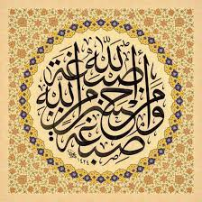

# Egyptian Arabic {.unnumbered}

These are my study notes structured as a path into **spoken Egyptian Arabic** (العامية المصرية)

{width=70% fig-align="center"}

## How to use it

- **Arabic is always visible.** Wherever you see a sentence, you can tap it to reveal its *franco* (Latin-letter transcription) and its English meaning. Try to read the Arabic first.
- **Franco uses the Egyptian number system**, where a few digits stand in for sounds with no Latin letter: **2 = ء/ق · 3 = ع · 7 = ح · 5 = خ · 8 = غ**. The emphatic letters (ص، ط، ض) are written as plain s, t, d.
- **Two tracks, move freely between them.** The **Grammar** chapters explain how the language works — verb types, the article, negation, and so on. The **Conversation** chapters put the language to use around a theme and the vocabulary that comes with it. The conversation chapters don't wait for the grammar; when you want the mechanics behind something, jump to the matching grammar chapter.

------------------------------------------------------------------------

## Part I — Grammar

The reference track: how Egyptian Arabic is built.

- **G1 · Sentences without "to be"** — pronouns, gender, and the *mesh* negation
- **G2 · The definite article and agreement** — *el-… el-…*: "the red book" vs "the book is red"
- **G3 · Verbs in the present** — the بـ prefix, the verb types (sound, hollow, final-weak, doubled, reflexive), and the participle
- **G4 · Verbs in the past** — the suffix conjugation, type by type
- **G5 · Verbs in the future** — the هـ prefix
- **G6 · Negation** — *mesh* vs the wrapped *ma…sh*
- **G7 · Adverbs** — time, place, frequency, manner
- **G8 · The bare imperfect** — the "subjunctive" form after *3ayez, lazem, momken*
- **G9 · Conditionals** — sentences with *law*

------------------------------------------------------------------------

## Part II — Conversation

The thematic track: each chapter brings a topic and the words that live with it.

- **C1 · Greetings and politeness**
- **C2 · Introducing yourself** — name, origin, age, and the question words
- **C3 · This and that** — the objects around you (clothes, furniture, animals)
- **C4 · Colors and sizes** — describing things
- **C5 · Liking, wanting, disliking** (حب / عايز / بكره) — food, drink, eating and drinking
- **C6 · Work** (اشتغل) — jobs and the places you work
- **C7 · Studying and learning** (اتعلم) — languages, music, instruments, culture
- **C8 · Speaking and understanding** (اتكلم / فهم)
- **C9 · Knowing and being acquainted** (عرف)
- **C10 · Movement** (راح / جه / رجع) — going, directions, and places
- **C11 · The daily routine** — waking, sleeping, meals, telling the time
- **C12 · Saying, telling, hearing** (قال / حكى / سمع) — reported speech

------------------------------------------------------------------------

*New chapters are added one at a time. A ✓ in the sidebar means a chapter is ready; the rest are on the way.*
