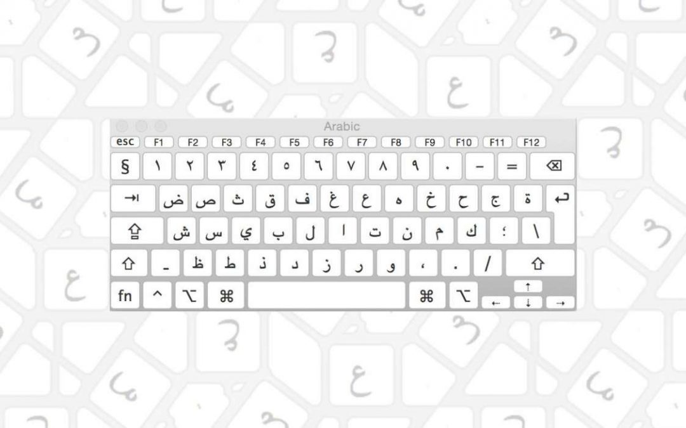

# The Arabic Alphabet {.unnumbered}

{width="70%" fig-align="center"}

## Links

[Class notes — Samar](https://docs.google.com/document/d/1ck11JW4C7QPxEVAoYGGeLnknu85bdGeNRC__zvVE6T8/edit?tab=t.0){target="_blank"}

[Audio: *Kallimni Arabi Bishweesh* (SoundCloud)](https://soundcloud.com/search?q=Kallimni%20Arabi%20bishweesh){target="_blank"}

### Other

[Class notes — Sara](https://docs.google.com/document/d/1yO3hzlxHDyXeFrfC4EnlAfRnNH2ZCL2-go2W7aC9Qaw/edit?tab=t.0#heading=h.64ku5rk9jyl9){target="_blank"}

[Class notes](https://docs.google.com/document/d/1BIOxZzzaPsZCRLroUvJiRrFjJgItGQWabALL139DafQ/edit?tab=t.0){target="_blank"}

------------------------------------------------------------------------

## Introduction

The Arabic alphabet has **28 letters** and is written **right to left**. Most letters change shape depending on where they sit in the word:

- **Isolated** — the letter on its own
- **Initial** — at the start of a word
- **Medial** — in the middle
- **Final** — at the end

A few letters **don't join to the letter that follows them**, so they only have two shapes (isolated/final and initial/medial).

------------------------------------------------------------------------

## The full alphabet

### 1. Alif — ا

| Form   | Isolated | Initial | Medial | Final |
|--------|----------|---------|--------|-------|
| Arabic | ا        | ا       | ـا     | ـا    |

**Note:** Alif doesn't join to the following letter.

**Sound:** long "aa", or a seat for hamza.

**Examples:** أنا - ana - I · باب - bab - door · سارة - Sara - Sara (name) · ساعة - sa3a - hour / clock

------------------------------------------------------------------------

### 2. Baa — ب

| Form   | Isolated | Initial | Medial | Final |
|--------|----------|---------|--------|-------|
| Arabic | ب        | بـ      | ـبـ    | ـب    |

**Sound:** "b" as in "boy".

**Examples:** بيت - bet - house · كتاب - kitab - book · بنت - bint - girl / daughter · حبيب - 7abib - dear / beloved

------------------------------------------------------------------------

### 3. Taa — ت

| Form   | Isolated | Initial | Medial | Final |
|--------|----------|---------|--------|-------|
| Arabic | ت        | تـ      | ـتـ    | ـت    |

**Sound:** "t" as in "top".

**Examples:** تلاتة - talata - three · بنت - bint - girl · تاكسي - taxi - taxi · توت - toot - berries

------------------------------------------------------------------------

### 4. Thaa — ث

| Form   | Isolated | Initial | Medial | Final |
|--------|----------|---------|--------|-------|
| Arabic | ث        | ثـ      | ـثـ    | ـث    |

**Sound:** "th" as in English "think". This is mostly Modern Standard Arabic — in Egyptian it usually becomes ت (t) or س (s).

**Examples:** ثلاثة - talata - three (MSA; Egyptian uses تلاتة) · مثال - masal - example · باحث - ba7es - researcher

------------------------------------------------------------------------

### 5. Geem — ج

| Form   | Isolated | Initial | Medial | Final |
|--------|----------|---------|--------|-------|
| Arabic | ج        | جـ      | ـجـ    | ـج    |

**Sound:** a hard "g" as in "go" (in Egypt). In other dialects it's "j" as in French "je".

**Examples:** جامعة - gam3a - university · راجل - ragel - man · جوز - gozz - husband · جميل - gamil - beautiful

------------------------------------------------------------------------

### 6. 7aa — ح

| Form   | Isolated | Initial | Medial | Final |
|--------|----------|---------|--------|-------|
| Arabic | ح        | حـ      | ـحـ    | ـح    |

**Sound:** "7" — a breathy h from deep in the throat (like fogging a mirror).

**Examples:** حب - 7ob - love · صباح - saba7 - morning · حلو - 7elw - sweet / nice · أحمر - a7mar - red

------------------------------------------------------------------------

### 7. Khaa — خ

| Form   | Isolated | Initial | Medial | Final |
|--------|----------|---------|--------|-------|
| Arabic | خ        | خـ      | ـخـ    | ـخ    |

**Sound:** "5" — like the "ch" in Scottish "loch" or Spanish "j".

**Examples:** خمسة - 5amsa - five · أخ - a5 - brother · مطبخ - matba5 - kitchen · خبر - 5abar - news

------------------------------------------------------------------------

### 8. Daal — د

| Form   | Isolated | Initial | Medial | Final |
|--------|----------|---------|--------|-------|
| Arabic | د        | د       | ـد     | ـد    |

**Note:** Daal doesn't join to the following letter.

**Sound:** "d" as in "door".

**Examples:** دكتور - doktor - doctor · يد - eed - hand · بلد - balad - country · درس - dars - lesson

------------------------------------------------------------------------

### 9. Dhaal — ذ

| Form   | Isolated | Initial | Medial | Final |
|--------|----------|---------|--------|-------|
| Arabic | ذ        | ذ       | ـذ     | ـذ    |

**Note:** Dhaal doesn't join to the following letter.

**Sound:** "th" as in English "this". Mostly MSA — in Egyptian it often becomes د (d) or ز (z).

**Examples:** ذهب - dahab - gold · أستاذ - ostaz - professor · ذاكر - zaakir - to study / revise

------------------------------------------------------------------------

### 10. Raa — ر

| Form   | Isolated | Initial | Medial | Final |
|--------|----------|---------|--------|-------|
| Arabic | ر        | ر       | ـر     | ـر    |

**Note:** Raa doesn't join to the following letter.

**Sound:** a rolled "r" (as in Spanish).

**Examples:** راجل - ragel - man · بحر - ba7r - sea · نور - noor - light · كبير - kbeer - big

------------------------------------------------------------------------

### 11. Zaay — ز

| Form   | Isolated | Initial | Medial | Final |
|--------|----------|---------|--------|-------|
| Arabic | ز        | ز       | ـز     | ـز    |

**Note:** Zaay doesn't join to the following letter.

**Sound:** "z" as in "zoo".

**Examples:** زمان - zaman - long ago / time · جوز - gozz - husband · لوز - looz - almonds · زي - zayy - like / as

------------------------------------------------------------------------

### 12. Seen — س

| Form   | Isolated | Initial | Medial | Final |
|--------|----------|---------|--------|-------|
| Arabic | س        | سـ      | ـسـ    | ـس    |

**Sound:** "s" as in "sun".

**Examples:** ستة - setta - six · درس - dars - lesson · سلام - salam - peace · اسم - esm - name

------------------------------------------------------------------------

### 13. Sheen — ش

| Form   | Isolated | Initial | Medial | Final |
|--------|----------|---------|--------|-------|
| Arabic | ش        | شـ      | ـشـ    | ـش    |

**Sound:** "sh" as in "ship".

**Examples:** شغل - sho8l - work · عيش - 3eesh - bread · شاي - shay - tea · مش - mesh - not

------------------------------------------------------------------------

### 14. Saad — ص

| Form   | Isolated | Initial | Medial | Final |
|--------|----------|---------|--------|-------|
| Arabic | ص        | صـ      | ـصـ    | ـص    |

**Sound:** an emphatic, deeper "s".

**Examples:** صباح - saba7 - morning · مصر - masr - Egypt · صاحب - sa7eb - friend · فصل - fasl - class / season

------------------------------------------------------------------------

### 15. Daad — ض

| Form   | Isolated | Initial | Medial | Final |
|--------|----------|---------|--------|-------|
| Arabic | ض        | ضـ      | ـضـ    | ـض    |

**Sound:** an emphatic, deeper "d".

**Examples:** أبيض - abyad - white · ضرب - darab - hit · ضيق - dayya2 - tight

------------------------------------------------------------------------

### 16. Taa — ط

| Form   | Isolated | Initial | Medial | Final |
|--------|----------|---------|--------|-------|
| Arabic | ط        | طـ      | ـطـ    | ـط    |

**Sound:** an emphatic, deeper "t".

**Examples:** طماطم - tamatem - tomatoes · بطة - batta - duck · خط - 5att - line · طويل - tawil - tall / long

------------------------------------------------------------------------

### 17. Zaa — ظ

| Form   | Isolated | Initial | Medial | Final |
|--------|----------|---------|--------|-------|
| Arabic | ظ        | ظـ      | ـظـ    | ـظ    |

**Sound:** an emphatic "z" (an emphatic "dh" in MSA). In Egyptian it often merges with ض or ز.

**Examples:** نظارة - naddara - glasses · ظرف - zarf - envelope · ظابط - zabet - officer

------------------------------------------------------------------------

### 18. 3ain — ع

| Form   | Isolated | Initial | Medial | Final |
|--------|----------|---------|--------|-------|
| Arabic | ع        | عـ      | ـعـ    | ـع    |

**Sound:** "3" — a voiced sound from deep in the throat, made by tightening the back of the throat. There's no English equivalent.

**Examples:** عربي - 3araby - Arabic · عين - 3een - eye · سعيد - sa3id - happy · عايز - 3ayez - wanting

------------------------------------------------------------------------

### 19. Ghain — غ

| Form   | Isolated | Initial | Medial | Final |
|--------|----------|---------|--------|-------|
| Arabic | غ        | غـ      | ـغـ    | ـغ    |

**Sound:** "8" — like a French/German "r", or a gargle.

**Examples:** غالي - 8aali - expensive · لغة - lo8a - language · صغير - so8ayyar - small · غير - 8er - other / except

------------------------------------------------------------------------

### 20. Faa — ف

| Form   | Isolated | Initial | Medial | Final |
|--------|----------|---------|--------|-------|
| Arabic | ف        | فـ      | ـفـ    | ـف    |

**Sound:** "f" as in "fish".

**Examples:** فين - feen - where · فهم - fehem - understood · صيف - seef - summer · فطار - fetar - breakfast

------------------------------------------------------------------------

### 21. Qaaf — ق

| Form   | Isolated | Initial | Medial | Final |
|--------|----------|---------|--------|-------|
| Arabic | ق        | قـ      | ـقـ    | ـق    |

**Sound:** "2" in Egypt — a glottal stop (the catch in the middle of "uh-oh"). In other dialects it's a deep "q".

**Examples:** قهوة - 2ahwa - coffee · قلب - 2alb - heart · فوق - fo2 - above · قال - 2al - said

------------------------------------------------------------------------

### 22. Kaaf — ك

| Form   | Isolated | Initial | Medial | Final |
|--------|----------|---------|--------|-------|
| Arabic | ك        | كـ      | ـكـ    | ـك    |

**Sound:** "k" as in "key".

**Examples:** كتاب - kitab - book · كلب - kalb - dog · سمك - samak - fish · كويس - kwayes - good

------------------------------------------------------------------------

### 23. Laam — ل

| Form   | Isolated | Initial | Medial | Final |
|--------|----------|---------|--------|-------|
| Arabic | ل        | لـ      | ـلـ    | ـل    |

**Sound:** "l" as in "love".

**Examples:** لغة - lo8a - language · ليه - leeh - why · جميل - gamil - beautiful · ليل - leil - night

------------------------------------------------------------------------

### 24. Meem — م

| Form   | Isolated | Initial | Medial | Final |
|--------|----------|---------|--------|-------|
| Arabic | م        | مـ      | ـمـ    | ـم    |

**Sound:** "m" as in "moon".

**Examples:** مصر - masr - Egypt · اسم - esm - name · تمام - tamam - perfect / OK · مية - maya - water

------------------------------------------------------------------------

### 25. Noon — ن

| Form   | Isolated | Initial | Medial | Final |
|--------|----------|---------|--------|-------|
| Arabic | ن        | نـ      | ـنـ    | ـن    |

**Sound:** "n" as in "no".

**Examples:** نور - noor - light · بنت - bint - girl · أنا - ana - I · نام - nam - slept

------------------------------------------------------------------------

### 26. Haa — ه

| Form   | Isolated | Initial | Medial | Final |
|--------|----------|---------|--------|-------|
| Arabic | ه        | هـ      | ـهـ    | ـه    |

**Sound:** a soft, breathy "h" as in "hello".

**Examples:** هو - huwwa - he · فهم - fehem - understood · نهار - nahar - daytime · ليه - leeh - why

------------------------------------------------------------------------

### 27. Waaw — و

| Form   | Isolated | Initial | Medial | Final |
|--------|----------|---------|--------|-------|
| Arabic | و        | و       | ـو     | ـو    |

**Note:** Waaw doesn't join to the following letter.

**Sound:** "w" as in "wow", or a long "oo" / "u".

**Examples:** ولد - walad - boy · نور - noor - light · يوم - yom - day · و - we - and

------------------------------------------------------------------------

### 28. Yaa — ي

| Form   | Isolated | Initial | Medial | Final |
|--------|----------|---------|--------|-------|
| Arabic | ي        | يـ      | ـيـ    | ـي    |

**Sound:** "y" as in "yes", or a long "ee" / "i".

**Examples:** يوم - yom - day · بيت - bet - house · كبير - kbeer - big · في - fi - in

------------------------------------------------------------------------

## Special letters

### Hamza — ء

The hamza isn't a true letter but a mark for a **glottal stop**. It can stand alone or sit on/under another letter:

- **ء** — hamza on its own
- **أ** — hamza over alif
- **إ** — hamza under alif
- **ؤ** — hamza over waaw
- **ئ** — hamza over yaa

**Examples:** سؤال - so2al - question · أنا - ana - I · شيء - shay2 - thing · قرأ - 2ara - read

------------------------------------------------------------------------

### Taa Marbuta — ة

This appears only at the **end of a word** and usually marks the feminine:

- **ة** — taa marbuta (isolated / final)

**Examples:** مدرسة - madrasa - school · ساعة - sa3a - hour / clock · جامعة - gam3a - university · كويسة - kwayesa - good (f.)

------------------------------------------------------------------------

## Special joining: Laam-Alif — لا

When **ل** (laam) meets **ا** (alif), they form a special ligature:

- **لا** — laa

**Examples:** لا - la2 - no · لازم - lazem - it's necessary / must · ولا - walla - or

------------------------------------------------------------------------

## Vowels and diacritics

Written Arabic normally leaves out the short vowels. They can be shown with marks (rarely used in modern texts):

### Short vowels

- **َ◌** (fat7a) — short "a"
- **ِ◌** (kasra) — short "i"
- **ُ◌** (damma) — short "u"

### Long vowels

- **ا** (alif) — "aa"
- **ي** (yaa) — "ee" / "ii"
- **و** (waaw) — "oo" / "uu"

### Other marks

- **ْ◌** (sukoon) — no vowel
- **ّ◌** (shadda) — doubles the letter
- **ً◌** (tanween) — an "-an" ending

------------------------------------------------------------------------

## Arabic numerals

The Eastern Arabic digits differ from the Western ones:

| Western | 0   | 1   | 2   | 3   | 4   | 5   | 6   | 7   | 8   | 9   |
|---------|-----|-----|-----|-----|-----|-----|-----|-----|-----|-----|
| Arabic  | ٠   | ١   | ٢   | ٣   | ٤   | ٥   | ٦   | ٧   | ٨   | ٩   |

**Examples:** ٢٢ = 22 · ١٠ = 10 · ٢٠٢٥ = 2025

------------------------------------------------------------------------

## Tips for learning

1.  **Letters that don't join to the next one:** ا د ذ ر ز و — they only have two shapes (isolated/final).

2.  **Look-alikes** (told apart by the dots):

    - ب (1 dot below) · ت (2 dots above) · ث (3 dots above)
    - ج (1 dot below) · ح (no dot) · خ (1 dot above)
    - د (no dot) · ذ (1 dot above)
    - ر (no dot) · ز (1 dot above)
    - س (no dots) · ش (3 dots above)
    - ص (no dot) · ض (1 dot above)
    - ط (no dot) · ظ (1 dot above)
    - ع (no dot) · غ (1 dot above)

3.  **Practice:** first learn to recognize the isolated letters, then the joined shapes.

4.  **Writing:** practice writing right to left, joining letters where they connect.

------------------------------------------------------------------------

## The franco (Arabizi) system

Some Arabic sounds have no Latin letter, so numbers stand in for them:

- **2** = ء / ق (hamza / Egyptian qaaf) — a glottal stop
- **3** = ع (3ain) — a throaty voiced sound
- **5** = خ (khaa) — like Spanish "j" / Scottish "loch"
- **7** = ح (7aa) — a breathy throat "h"
- **8** = غ (ghain) — like a French/German "r"

### A few Egyptian notes

- **ق (qaaf) in Egypt** is usually pronounced **2** (a glottal stop): *qahwa → 2ahwa*.
- **El** before a word = "the".
- **W + vowel** contracts: *we + inta → winta*.
- Countries are always feminine.
- **Ya** before a name is an informal vocative: *ya Salma* = "hey Salma".
